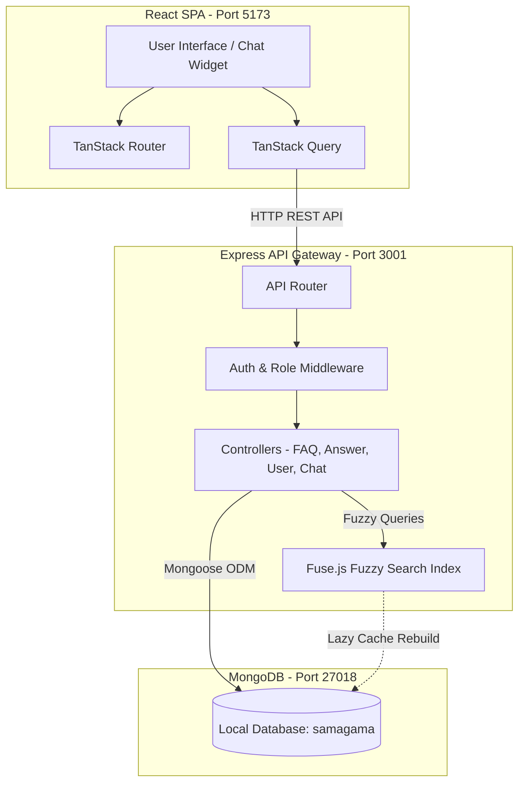

# Samagama FAQ Platform

A high-performance, community-driven FAQ platform and knowledge base designed for Samagama participants. The platform is engineered with a React/Vite single-page application (SPA) on the frontend, an Express/Node.js API gateway on the backend, and a localized MongoDB document database. It features a custom Fuse.js fuzzy-search chatbot, role-based administrative moderation, and real-time community engagement metrics.

---

## 🏗️ System Architecture



---

## 🛠️ Engineering Priority Stack & Implementations

### 1. Database Schema & Persistence Layer
The database is built on MongoDB using **Mongoose ODM** with schemas designed to scale for high read-to-write ratios:
*   **User Schema**: Stores credentials, emails, and roles (`user`, `admin`). Uses `bcrypt` for secure password hashing.
*   **FAQ Schema**: Contains title, description, category, status (`Answered`, `Unanswered`), view count, upvotes, and associations to the author.
*   **Answer Schema**: Links back to specific FAQs. Tracks author, content, upvotes, and an `isAccepted` boolean flag managed by administrators.
*   **UnansweredQuestion Schema**: Logs search terms that the chatbot failed to resolve. Uses a unique index on `normalizedQuestion` (lowercased/trimmed) with an `$inc` counter (`askCount`) to prevent duplicate entries and prioritize high-demand questions for admins.

### 2. Intelligent FAQ Chatbot Engine (Fuse.js Integration)
An in-memory, event-driven search pipeline designed for rapid response times (<10ms) without heavy database scanning:
*   **Weighted Fields**: Searches across multiple text fields with fine-tuned priority:
    $$\text{Score} = f(\text{title}: 0.30,\, \text{tags}: 0.25,\, \text{description}: 0.20,\, \text{answerContent}: 0.15)$$
*   **Confidence Thresholding**: Filters out results with a Fuse.js score $\ge 0.40$ to ensure irrelevant answers are not returned.
*   **Event-Driven Index Invalidation**: The search index is cached in memory. Whenever a FAQ or Answer is created, updated, or deleted, the backend triggers `invalidateIndex()`, marking the cache as stale. The next search request lazily rebuilds the index.
*   **Graceful Fallback**: Queries that return no matching FAQs are automatically saved as `UnansweredQuestions` in the DB.

### 3. API Gateway & Security
An Express-based REST API that isolates concerns and enforces system policies:
*   **JWT Authentication**: Employs stateless token verification for user sessions.
*   **Role-Based Access Control (RBAC)**: Protects administrative routes (e.g., editing FAQs, deleting answers, retrieving unresolved queries) using a custom validation middleware.
*   **CORS Configuration**: Explicitly permits cross-origin requests from the client URL (defaulting to `http://localhost:5173`).
*   **Centralized Error Handling**: An Express middleware captures all uncaught exceptions, logs stack traces, and prevents internal server leaks by returning sanitized `500 Internal Server Error` responses.

### 4. Client State & Routing Architecture
The frontend leverages modern React paradigms to optimize performance and prevent re-rendering lags:
*   **State Management (TanStack Query)**: Handles all backend API requests, server-side caching, cache invalidation (queries refetch when answers/upvotes occur), and optimistic UI state updates.
*   **Type-Safe Routing (TanStack Router)**: Manages page layouts, nested routes (e.g., detail views), and navigation trees cleanly.
*   **Interactive Chat Widget**: A persistent, floating chat window on the interface. Provides immediate answers, source attribution links, loading animations, and clickable suggested/related questions.

### 5. Admin Command & Control & Analytics
*   **Moderation Panel**: Allows administrators to view, modify, and delete questions. They can review unresolved user questions caught by the chatbot, draft answers to resolve them, and publish them to the public FAQ board.
*   **Analytics Dashboards**: Renders statistics including FAQ category distribution, unanswered vs. answered ratios, active platform contributors, and total read engagement.

---

## ⚙️ Local Development Setup

To run the application locally, you must run a dedicated local MongoDB instance to access the pre-seeded platform data.

### Database Setup
The system-wide MongoDB service typically runs on default port `27017`. To avoid conflicts and access the seeded platform database, start a local MongoDB daemon pointing to the project's data directory on port **`27018`**:

```bash
mongod --port 27018 --dbpath ./mongodb_data --logpath ./mongodb_data/mongod.log --fork
```

### Backend Setup
1. Navigate to the backend folder:
   ```bash
   cd samagama/backend
   ```
2. Verify the `.env` configuration contains:
   ```env
   PORT=3001
   MONGO_URI=mongodb://localhost:27018/samagama
   CLIENT_URL=http://localhost:5173
   ```
3. Run the development API server:
   ```bash
   npm run dev
   ```

### Frontend Setup
1. Navigate to the frontend folder:
   ```bash
   cd samagama/frontend
   ```
2. Start the Vite development server:
   ```bash
   npm run dev
   ```
3. Open `http://localhost:5173` in your browser.
